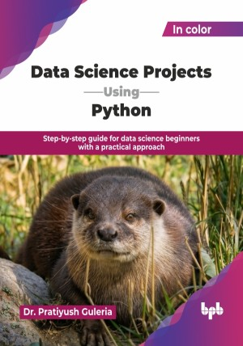

# Data Science Projects Using Python

Step-by-step guide for data science beginners with a practical approach.

This is the repository for [Data Science Projects Using Python
](https://bpbonline.com/products/data-science-projects-using-python-1?variant=45055870337224), published by BPB Publications.

## About the Book
Python has emerged as one of the most widely used programming languages, especially in the fields of data science, machine learning, and artificial intelligence. With the growing demand for data-driven decision-making and automation, acquiring skills in Python and data science has become essential for students and professionals alike.

This book provides a strong foundation in Python programming while gradually introducing core concepts of data science and machine learning. Beginning with Python fundamentals, the book covers data handling using NumPy and Pandas, data preprocessing techniques, and data visualization using Matplotlib. It further introduces supervised, unsupervised, and reinforcement learning concepts using simple and illustrative examples. Each chapter includes exercises to support academic learning, competitive examinations, and interview preparation. The book also features beginner-level, illustrative projects to reinforce practical understanding.

By the end of this book, readers will be well-equipped with essential programming skills in Python and a clear understanding of data science workflows. They will be able to analyze data, visualize insights, apply basic machine learning techniques, and solve real-world problems with confidence.

## What You Will Learn
• Understand core Python programming concepts with practical examples.

• Work with NumPy and Pandas data structures efficiently.

• Perform data preprocessing and basic data cleaning techniques.

• Visualize data effectively using Matplotlib charts and plots.

• Learn the fundamentals of supervised and unsupervised machine learning.

• Solve real-world problems through beginner-level Python data projects.
